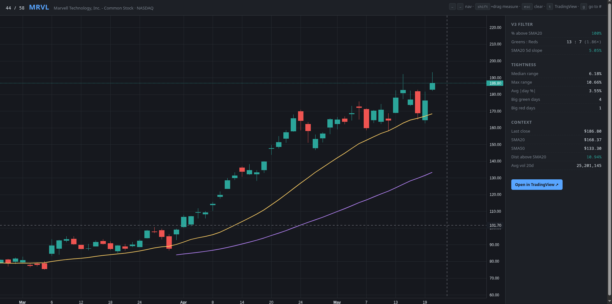

# Investment — TOP Pattern Scanner

Weekly scanner that pre-filters the broad US stock universe for **Pete Stolzers' TOP pattern**
(Tight Orderly Progression) candidates on the daily chart.

> **Scope:** Phase 1 — **Price Action** only. Fundamentals come in Phase 2.

## What it does

1. Builds a tradeable US universe (~1,500-2,000 tickers, 20-day avg volume ≥ 2M shares).
2. Pulls ~80 days of daily OHLCV via yfinance.
3. Computes SMA20, SMA50, SMA50 slope, distances, days-above-SMA50.
4. Filters to tickers where **`close > SMA50` AND `SMA50` is rising** (5-day delta > 0).
5. Writes a CSV with one row per candidate to `.tmp/top_candidates_YYYY-MM-DD.csv`.

> Google Sheets output is deferred. CSV is the current deliverable.

## Setup (one-time)

```bash
cd /home/nublet/Projects/investment
python3 -m venv .venv
source .venv/bin/activate           # bash/zsh
# or: source .venv/bin/activate.fish  # fish
pip install -r requirements.txt
```

## Weekly run

```bash
source .venv/bin/activate
python tools/build_universe.py        # refresh monthly, not weekly
python tools/fetch_daily_ohlcv.py
python tools/compute_top_signals.py
```

Result: `.tmp/top_candidates_YYYY-MM-DD.csv` — open in any spreadsheet tool, sort by
`sma50_slope_pct_5d` or `close_above_sma20`, and review the strongest 20-50 names manually
to confirm the TOP pattern visually.

## File layout

```
investment/
├── tools/                # Deterministic Python scripts
├── workflows/            # SOPs (read these to remember how to run things)
├── .tmp/                 # Intermediate + final outputs (gitignored)
├── .venv/                # Python venv (gitignored)
├── requirements.txt
└── README.md             # This file
```

## Pattern reviewer

The scanner feeds into a pattern reviewer UI that displays each candidate's chart with V3 filter metrics (tightness, green/red ratio, SMA slope) alongside the candlestick chart.



## See also

- `workflows/scan_top_pattern.md` — the weekly SOP
- `/home/nublet/Projects/CLAUDE.md` — WAT framework guidelines
