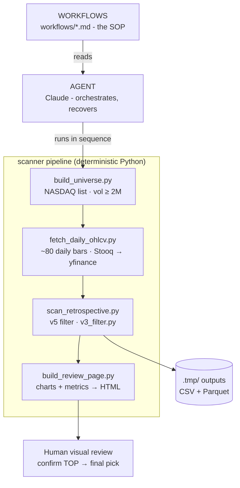

# 📈 TOP Pattern Scanner

[](LICENSE)
[](https://www.python.org/)
[](../CLAUDE.md)


A weekly stock scanner that pre-filters the broad US equity universe for **Pete Stolzer's TOP pattern** (Tight Orderly Progression) on the daily chart, then hands a short list of survivors to a visual reviewer so a human makes the final call.

> **Scope:** Phase 1: **price action only**. Fundamentals are deliberately *not* automated; they stay human judgment (Phase 2).

## What It Does

- Builds a tradeable US universe (~1,500–2,000 tickers, 20-day avg volume ≥ 2M shares)
- Pulls ~80 days of daily OHLCV (Stooq primary, yfinance fallback)
- Computes SMA20, SMA50, slopes, distances, and body-weighted green/red ratios
- Applies the **v5 filter** over a rolling 20-day window with a 30-day streak gate
- Writes a CSV of survivors, then renders each one in a chart reviewer for visual confirmation
- Funnels thousands of tickers down to a handful, because only ~5 real TOPs exist at any time

## Tech Stack

| Component | Role |
|-----------|------|
| **Python + pandas** | Deterministic execution: indicators, filtering, transforms |
| **yfinance / Stooq** | Daily OHLCV market data (hybrid: Stooq first, yfinance fallback) |
| **pyarrow / Parquet** | Fast intermediate storage for universe + signals |
| **NASDAQ Trader** | Source list for building the tradeable universe |
| **Claude (WAT agent)** | Orchestrates the workflow: runs tools in sequence, recovers from errors |
| **HTML reviewer** | Renders each candidate's candlestick chart + v5 metrics for the human pass |

## Architecture

This project runs on the **WAT framework**: probabilistic AI does the *reasoning*, deterministic Python does the *execution*. The scanner is a funnel; the visual review is the real selection step.



### How It Works

1. **(Monthly)** `build_universe.py` rebuilds the tradeable universe from NASDAQ Trader, filtered to 20-day avg volume ≥ 2M.
2. `fetch_daily_ohlcv.py` pulls ~80 days of daily bars for every ticker (Stooq primary, yfinance fallback).
3. `scan_retrospective.py` slides the **v5 filter** across every bar and keeps tickers that qualify.
4. `build_review_page.py` renders survivors as charts with their v5 metrics into an HTML reviewer.
5. A human opens the reviewer, confirms the TOP pattern visually, and picks entries.

### The v5 Filter

A bar passes only if, over a rolling **20 trading-day end-anchored window**:

- **R1**: ≥90% of closes above SMA20 (≥18 of 20)
- **R2b**: body-weighted green ≥ 1.5 × red
- **R4**: SMA20 5-day slope > 0
- **R5**: close > $5

…and the bar belongs to a run of **≥30 consecutive** passing days over which price rose **≥50%**. The 30-day gate means a name surfaces ~1 month after its visual TOP-start, deliberately, because 30+ days is what *verifies* the pattern rather than guessing early.

## Quick Start

### 1. Set up the environment

```bash
cd /home/nublet/Projects/investment
python3 -m venv .venv
source .venv/bin/activate            # bash/zsh
# or: source .venv/bin/activate.fish # fish
pip install -r requirements.txt
```

### 2. Configure secrets

```bash
# .env
STOOQ_API_KEY=your_key_here
```

### 3. Run the weekly scan

```bash
source .venv/bin/activate
python tools/build_universe.py        # monthly, not weekly
python tools/fetch_daily_ohlcv.py
python tools/scan_retrospective.py
python tools/build_review_page.py
```

Open the generated `.tmp/review_<date>.html` and confirm the strongest names visually.

## File Layout

```
investment/
├── tools/          # Deterministic Python scripts (the execution layer)
├── workflows/      # Markdown SOPs - read these to remember how to run things
├── charts/         # Reference TOP charts + reviewer screenshot
├── .tmp/           # Intermediate + final outputs (gitignored)
├── requirements.txt
└── README.md       # This file
```

## See Also

- [`workflows/scan_top_pattern.md`](workflows/scan_top_pattern.md) - the weekly SOP, with the v5 signal definition and known quirks
- [`../CLAUDE.md`](../CLAUDE.md) - the WAT framework guidelines this project follows
